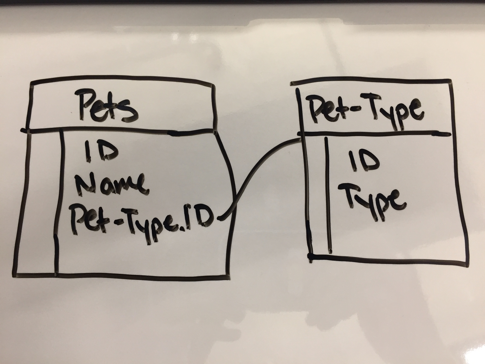
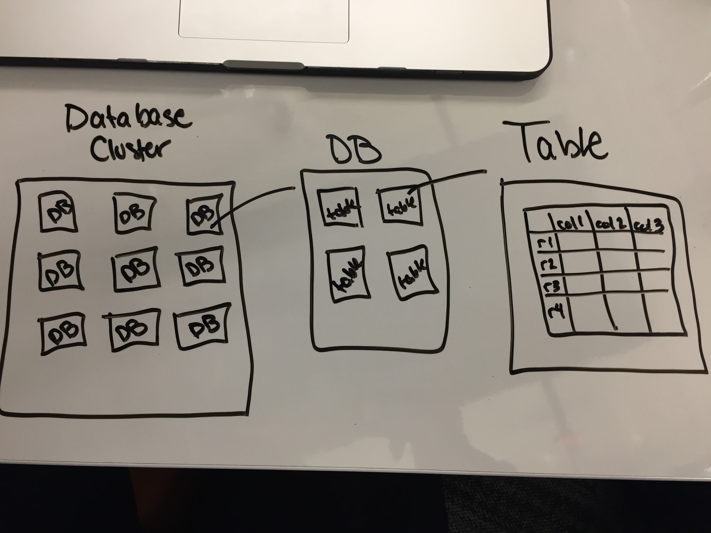

# SQL/Databases

- Explain the difference between data and information

  data are facts, raw facts that are not tied to anything. No information to understand what the facts are

  ```javascript
  1;
  'Frozen';
  102;
  'PG';
  'Animation';
  true;
  new Date('2013-11-27 00:00:00 UTC');
  7.6;
  ```

  information facts about something or someone (with context)

  ```javascript
  const movie = {
    id: 1,
    title: 'Frozen',
    duration: 102,
    rating: 'PG',
    genre: 'Animation',
    is3D: true,
    releasedAt: new Date('2013-11-27 00:00:00 UTC'),
    score: 7.6
  };
  ```

- Explain what an entity is

  an entity is an object that represents a person, place or thing

  ​	entities have **attributes** that is a piece of information that describes an entity

  **Entity Relationship Diagram (ERD)**

  |      | PETS             |
  | ---- | ---------------- |
  |      | Name             |
  |      | Age              |
  |      | Species          |
  |      | Date of Purchase |
  |      | Date of Sale     |

- Diagram how server-side web apps manage information

  ```
  ┌─── Client ──┐               ┌── Service  ──┐               ┌─   Data   ─┐
  │             │─── request ──▶│             │──── write ───▶│    fs       │
  │  FrontEnd   │               │    Server   │    command     │    RDBMS    │
  │   Browser   │               │    Node     │                │    Cache    │
  │   Chrome    │               │    Express  │                │             │
  │             │               │    RESTful  │                │             │
  │just display │◀── response ──│             │◀─── read ─────│             │
  └─────────────┘               └─────────────┘      data      └─────────────┘
  ```

- Explain what a RDBMS is

  **Relational Database System**

  a database system based on how the data relates to each other 

  ​	based on the relational mode

  ​		modeling information and its relationships to other information	

  the relational model represents information in tables

  ​	an entity is a row

  ​	attributes are columns

  ​		all values in a column must be of the same type - keeps the data honest

  

- Explain why a RDBMS is useful

  adds consistancy and reusability

- Explain what SQL is

  **S**tructured **Q**uery **L**anguage

  standard language that databases interact with

  SQL has 3 distinct languages:

  ​	data definition language (DDL) - for managing tables

  ​	data manipulation language (DML) - for managing rows

  ​	data control language (DCL) - for managing permissions to the tables and rows

  is not completely portable between different relational database systems without adjustments

  Some SQL databases

  ​	PostgreSQL (OPEN source)

  ​	MySQL (OPEN source)

  ​	SQLite (OPEN source)

  ​	Microsoft Access (CLOSED source)

  ​	Microsoft SQL Server (CLOSED source)

  ​	Oracle (CLOSED source)

  Use open source databases because then you aren't under the control of the companies that own the closed source database

- Explain what PostrgeSQL is

  a powerful open source relational database system

  runs on all major operating systems

  native interfaces for a number of programing languages

  exceptional documentation

  fully ACID (atomicity consistency isolation durability) complaint

  has a vast amout of built-in data types

  ​	boolean

  ​	character (char)

  ​	character varying (varchar)

  ​	integer

  ​	numeric

  ​	serial (used for ids, auto incremental)

  ​	text

  ​	timestamp

  PostgreSQL is a sophisticated relational database

  All the moving parts are:

  ​	a database server manages a database cluster

  ​	a database client connects to a database server

  ​	a database client sends SQL commands to a database server

  ​	a database server sends rows of information back to a database client

  ​	a single database cluster often contains multiple databases

  ​	a single database often contains multiple tables

  ​	a single table often contains multiple rows of information

  ​	rows are automatically persisted to the hard disk by the database server

- Intall PostrgeSQL